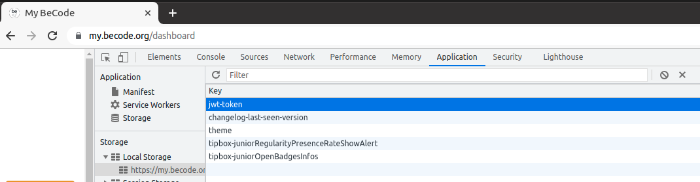

# bot_pointeur

## Merci à Joffrey (https://github.com/Joffreybvn)
Ce code est uniquement du code écrit par Joffrey et arrangé par moi-même.

## Tuto

Pour faire fonctionner ce code, différentes variables doivent être modifiées pour contenir vos informations.

### 1) Changer Token Becode
Dans le fichier [`main_share.py`](https://github.com/yolannos/bot_pointeur/blob/main/main_share.py) vous devez changer la valeur de `token` par votre token BeCode que vous pouvez vous procurer:

- soit en le générant à l'adresse `https://my.becode.org/profile/junior/prénom-nom/token` 
- soit en inspectant votre navigateur (Chrome only) > application > local storage > my.becode.org > jwt-token

### 2) Changer paramètres Envoi de mail
Pour pouvoir vous envoyez un mail de confirmation, il est nécessaire de changer dans le fichier [`send_email_share.py`](https://github.com/yolannos/bot_pointeur/blob/main/utils/send_email_share.py) les informations suivantes (à noter que l'on utilise un client Gmail):

- `sender_email`: l'adresse avec laquelle vous souhaitez envoyer le mail de confirmation
- `receiver_email`: l'adresse à laquelle vous voulez envoyer le mail de confirmation
- `password`: avec Gmail, il est nécessaire d'utiliser un App Passwords que vous pouvez générer en suivant le tuto [ici](https://support.google.com/accounts/answer/185833?hl=en).

## TODO
- ~~beginner level: Créer une condition pour initialiser la variable période en fonction de l'heure~~
- ~~intermediate level: Créer un cron qui exécute le script~~
- expert level: créer un serveur qui exécute le script 4 fois par jour
